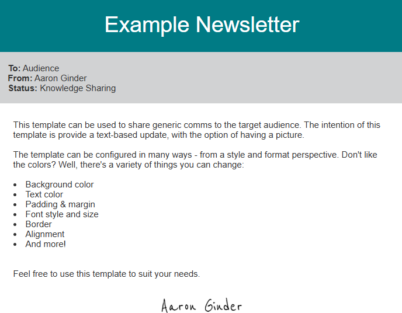

# Newsletter HTML Generator


## Table of Contents

- [Introduction](#introduction)
- [Installation](#installation)
- [Usage](#usage)
  - [Configuring an Email](#configuring-an-email)
  - [Sending a HTML Email](#sending-a-html-email)
- [Contributions](#contributions)
- [Feature Enhancements](#feature-enhancements)
- [Testing](#testing)
  - [Unit tests](#unit-tests)
- [Supporting References](#supporting-references)

### Introduction

The Email Newsletter HTML Generator is a Python package designed to automate the creation of HTML email templates using YAML configurations. It allows you to easily create professional email newsletters with various elements:

- Headers and footers
- Paragraphs with rich formatting
- Bulleted lists
- Images with embedding via Base64
- Custom blocks with multiple columns
- Icons and links

The generator creates well-formatted HTML files that can be directly used in email clients like Outlook for sending professional newsletters or announcements.

<div class="center-image">
  
  
  <br>
  
</div>

## Installation

### Requirements

Below are the pre-requisites that can be used to generate the expected output of this repository.

|Software   | Version   |
|-----------|-----------|
|Python     | `3`       |

### Install from GitHub

```sh
pip install git+https://github.com/aaronginder/html-email-generator.git
```

To install a specific version:

```sh
pip install git+https://github.com/aaronginder/html-email-generator.git@v1.0.0
```

### Development Installation

If you want to contribute or modify the package:

```sh
# Clone the repository
git clone https://github.com/aaronginder/html-email-generator.git
cd html-email-generator

# Install the poetry package manager
pip install poetry;

# Install the package dependencies
poetry install;
```

## Usage

### Configuring an Email

Specification for the `contents.yaml`:

```yaml
title:              [Required] The title of the email, which is used in the <title> tag of the HTML document.
layout:
    width:          [Required] The width of the email. For reference, "600px" is like a newsletter, "1000px" is near full screen size
sections:           [Required] A list of sections that define the structure and content of the email.
  - type:           [Required] The type of section. Available types are "header", "paragraph", "list", "image", "block", and "footer".
    content:        [Optional] The main text content of the section. Required for types: "header", "paragraph", and "footer".
                    - "header": The header text.
                    - "paragraph": Text with optional HTML tags.
                    - "footer": Footer text.
    styles:         [Optional] A dictionary of CSS styles to apply to the section. Example properties:
                    - background-color: Sets the background color.
                    - color: Sets the text color.
                    - padding: Defines the space inside the section.
                    - text-align: Aligns the text ("left", "center", "right").
                    - font-size: Sets the font size.
                    - border-radius: Rounds the corners of the section.
                    - box-shadow: Adds shadow effects.
    items:          [Required for "list"] A list of strings representing each list item. Example: 
                    - "First item in the list."
                    - "Second item with more details."
    src:            [Required for "image" and "icon"] The file path or URL of the image or icon to display.
    alt:            [Required for "image" and "icon"] The alternate text for the image or icon, used for accessibility.
    width:          [Optional] The width of the image or icon. Can be set in pixels (e.g., "50px") or percentages (e.g., "100%").
    height:         [Optional] The height of the image or icon. Can be set in pixels or as "auto" to maintain aspect ratio.
    rows:           [Required for "block"] A list of rows within the block. Each row can contain multiple columns.
      - columns:    [Required for "block" rows] A list of columns within each row. Each column can be of type "text", "icon", or "link".
          type:     [Required] The type of column content. Options are "text", "icon", or "link".
          content:  [Required for "text" and "link"] The text to display in the column. For "link", this is the clickable text.
          href:     [Required for "link"] The URL that the link points to.
          src:      [Required for "icon"] The file path or URL of the icon image.
          styles:   [Optional] A dictionary of CSS styles to apply to the column. Example properties:
                    - font-size: Sets the font size of text.
                    - color: Sets the text or link color.
                    - padding: Defines the space inside the column.
                    - text-decoration: Applies decoration to text (e.g., "none" to remove underlines from links).
                    - border-radius: Rounds the corners of buttons or containers.
```

Example `contents.yaml` data:

```yaml
title: "Your Email Title Here"

layout:
  type: "newsletter"
  width: "750px"

sections:
  - type: "header"
    content: "Header Content Here"
    styles:
      background-color: "#553a99"
      color: "#ffffff"
      padding: "15px"
      text-align: "center"
      font-size: "24px"
      border-radius: "5px"

  - type: "paragraph"
    content: |
      For optimal viewing of this email, use the <b>web</b> or <b>new outlook</b> application!
    styles:
      background-color: "#e9ecef"
      color: "#333333"
      padding: "5px"
      font-size: "16px"
      border-radius: "0px"
      text-align: center

  - type: "image"
    src: "samples/assets/backgrounds/coding-sample.jpg"
    alt: "Image description here"
    width: "75%"
    height: "auto"
    styles:
      border-radius: "10px"
      padding: "20px"
      text-align: "center"

  - type: "paragraph"
    content: |
      This is an example paragraph.
      You can use HTML tags like <br> for line breaks.
    styles:
      background-color: "#ffffff"
      color: "#333333"
      padding: "20px"
      font-size: "18px"
      text-align: "center"
      border-radius: "5px"

  - type: "list"
    items:
      - "First item in the list."
      - "Second item with more details."
      - "Third item with even more details."
    styles:
      background-color: "#e9ecef"
      color: "#333333"
      padding: "15px"
      font-size: "16px"
      border-radius: "5px"
      list-style-type: "disc"

  - type: "block"
    styles:
      background-color: "#ffffff"
      padding: "20px"
      border-radius: "5px"
      box-shadow: "0px 0px 5px rgba(0, 0, 0, 0.1)"
    rows:
      - columns:
          - type: "icon"
            src: "samples/assets/icons/click-color.jpg"
            alt: "Icon description"
            width: "100px"
            height: "auto"
            styles:
              margin-right: "10px"
          - type: "text"
            content: "Text content here."
            styles:
              font-size: "16px"
              text-align: "left"
          - type: "link"
            content: "Click Here"
            href: "https://example.com"
            styles:
              color: "#007BFF"
              text-decoration: "none"
              font-size: "16px"
              padding: "10px 15px"
              border-radius: "5px"

  - type: "image"
    src: "samples/assets/icons/image-small.jpg"
    alt: "Image description here"
    width: "25%"
    height: "auto"
    styles:
      border-radius: "10px"
      padding: "10px"
      text-align: "center"

  - type: "footer"
    content: "Thank you for being a valued member of our community."
    styles:
      background-color: "#333333"
      color: "#ffffff"
      padding: "20px"
      text-align: "center"
      font-size: "14px"
      border-radius: "5px"
```

The above configuration creates the below HTML file:
<div class=center-image>

</div>

### Sending a HTML Email

1. Open the html email file in the `target` folder. Copy the contents of the whole file
2. Remove all text in the email body. Then, type "***" in your email body
3. Navigate to the browser for your respective email provider and hold `CTRL + F12` to open the inspect panel
4. Search for the body text by pressing `CTRL + F` and search for "***"
5. Right click, "Edit as HTML". Replace the html code with the code you copied in step 1.
6. Close the inspector and send your email

## Contributions

We welcome contributions to this project. Please follow these steps:

- Create a new branch (git checkout -b feature/your-feature).
- Commit your changes (git commit -am 'Add some feature').
- Push to the branch (git push origin feature/your-feature).
- Create a new pull request.

## Feature Enhancements

- Add more unit test coverage
- Implement integration tests for HTML file generation
- In addition to email generation, send the email to specified recipients

## Testing

### Unit Tests

This section details the unit tests that have been implemented as part of this repository.

|Test Case  | Description   | Test Case Type   |
|-----------|---------------|------------------|
|test_load_config| Test that the configuration is loaded correctly|Positive|
|test_encode_image_base64|Test that image encoding works correctly|Positive|
|test_generate_html|Test that the HTML file is generated correctly.|Positive|
|test_generate_html_with_random_titles|Test generating HTML with random titles using Hypothesis|Neutral|
|test_image_alt_text|Test that random alt text appears correctly in the generated HTML|Neutral|
|test_invalid_image_path|Test that the HTML correctly handles invalid image paths|Negative|

## Supporting References

Refer to the `samples/` directory for configuration examples.
